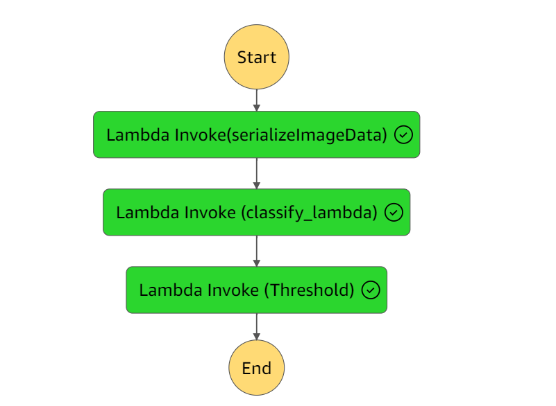
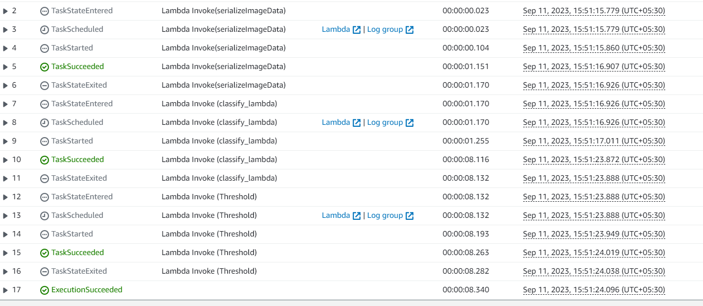

#  Build a ML Workflow for Scones Unlimited on Amazon SageMaker

## Overview
This project demonstrates an end-to-end machine learning workflow built on AWS using Amazon SageMaker. It is part of the AWS Advanced AI/ML Nanodegree program and simulates a real-world production ML system for a fictional logistics company, **Scones Unlimited**, where the goal is to classify vehicle types from images to support automated delivery operations.

---

##  Objective
To design and implement a scalable, production-style machine learning pipeline that includes:
- Data ingestion and preprocessing
- Model training using Amazon SageMaker
- Real-time model deployment
- Event-driven inference automation using AWS services

---

##   Tech Stack
- Python
- Amazon SageMaker
- Amazon S3
- AWS Lambda
- AWS Step Functions
- Boto3
- Machine Learning (Image Classification)

---

##  Architecture Overview

The workflow is divided into four main stages:

### 1. Data Preparation
- Dataset stored in Amazon S3
- Training and validation data organized for SageMaker processing
- Boto3 used for S3 bucket and data management

---

### 2. Model Training
- Used SageMaker built-in Image Classification algorithm
- Training job configured using SageMaker Estimator
- Hyperparameters tuned for optimal performance

---

### 3. Model Deployment
- Deployed trained model as a real-time SageMaker endpoint
- Enabled Data Capture for monitoring predictions and performance

---

### 4. Event-Driven ML Pipeline
- AWS Lambda functions used for:
  - Data preprocessing
  - Model inference invocation
  - Logging predictions
- AWS Step Functions used to orchestrate the full workflow

---

## 🖼️ Workflow Visualizations

###   Step Functions Flow (Architecture Overview)
This diagram shows the high-level orchestration of the ML pipeline across AWS services.

---

###   Step Functions Working (Execution Flow)
This diagram shows the runtime execution of the Step Functions state machine, illustrating how Lambda functions are triggered in sequence.

---

##  Results / Outcome
- Built a fully automated, event-driven ML pipeline on AWS
- Successfully deployed a scalable image classification model
- Implemented serverless inference workflow using Lambda and Step Functions
- Demonstrated production-style MLOps architecture

---

##  Key Learnings
- End-to-end ML system design on AWS
- Model training and deployment using SageMaker
- Serverless ML architecture using Lambda and Step Functions
- MLOps workflow orchestration and automation
- Real-world production ML system design patterns

---
